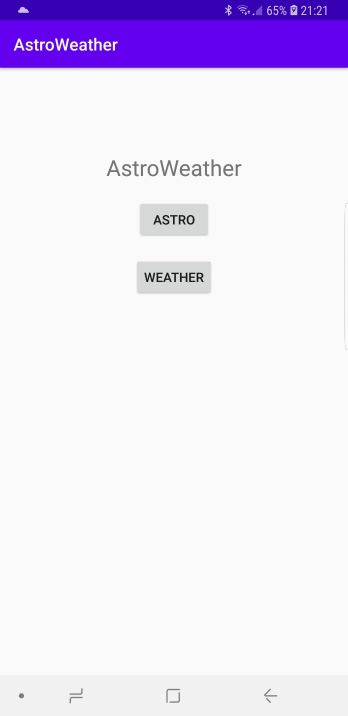
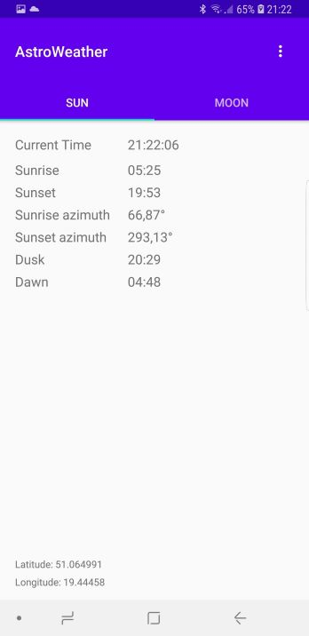
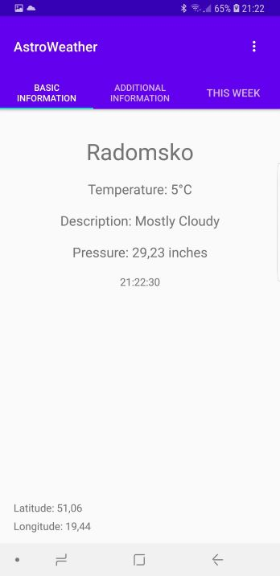
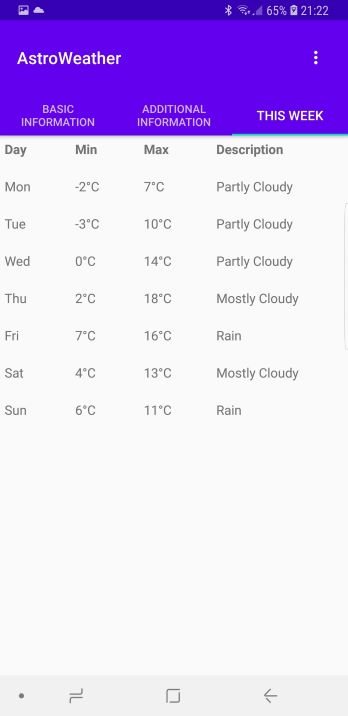
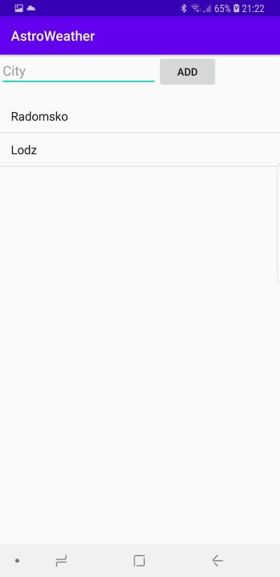
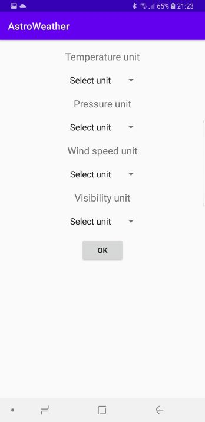

# AstroWeather
This application allows you to check astronomical and weather information for a selected location. You can save your favorite locations or change units related to weather information.

## Screenshots

## Technologies
* Java
* Android SDK
* SQLite

## Features
* Astronomical information related to sun and moon
* Detailed weather information
* Weather forecast for the whole week
* Change localization
* Add your favorite locations
* Change units
* Saving weather information to a file

## Status
Project is _finished_
